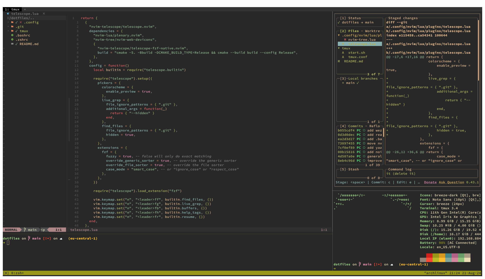

# ~/dotfiles

Dotfile configuration for `archlinux`.



## Install

To setup the configuration files, it is recommended to install:

- [Neovim](https://neovim.io)
- [Wezterm](https://wezfurlong.org/wezterm)
- [Zsh](https://wiki.archlinux.org/title/Zsh)
- [Starship](https://starship.rs)
- [Stow](https://www.gnu.org/software/stow/manual/stow.html)
- [Paru](https://github.com/Morganamilo/paru)

Clone this repository in the main `$HOME` folder.

```bash
$ git clone git@github.com:phcurado/dotfiles.git
$ cd dotfiles
```

Then use the GNU `stow` to create symlinks:

```bash
$ stow .
```

Some files might conflict, `stow` will throw an error and list the files that already exists on the OS.
It's possible to override the existent files, adding the `--adopt` argument on stow:

```bash
$ stow --adopt .
```
