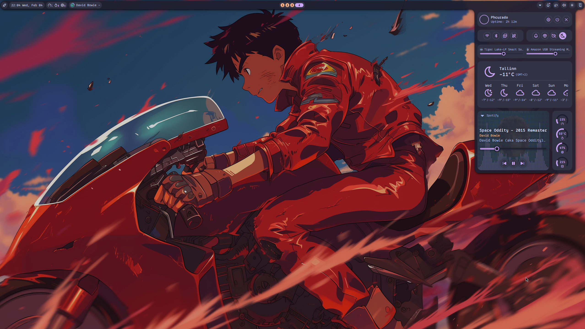
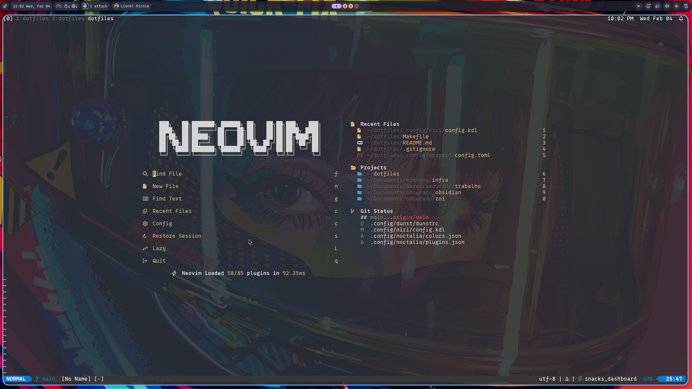

# ~/dotfiles

Dotfile configuration for `archlinux`.

## Screenshots





## Quick Start

After a fresh Arch install, you'll be in a TTY. Clone the repo and run the setup script:

```bash
git clone git@github.com:phcurado/dotfiles.git ~/dotfiles
cd ~/dotfiles
# Install script
./setup.sh
# Some changes requires system reboot
reboot
```

SDDM will start on boot. Select niri and login. Open a terminal with `Super + T` and connect to WiFi using noctalia's network panel.

## Main Packages

### Paru

[Paru](https://github.com/Morganamilo/paru) is an AUR helper for installing packages from the Arch User Repository.

```bash
sudo pacman -S --needed base-devel
git clone https://aur.archlinux.org/paru.git /tmp/paru
cd /tmp/paru
makepkg -si
```

> [!NOTE]
> All packages below are included in `arch-pkgs/pkgs.txt` and can be installed at once with `make install`. The individual install commands are shown for reference only.

### Neovim

[Neovim](https://neovim.io) is my preferred text editor.

```bash
paru neovim
```

### Ghostty

[Ghostty](https://ghostty.org/) is a modern terminal emulator.

> [!IMPORTANT]
> Ghostty is configured to use the font [0xProto Nerd Font](https://github.com/0xType/0xProto). Install it or change the font in [.config/ghostty/config](.config/ghostty/config). List available fonts with `ghostty +list-fonts`.

```bash
paru ghostty
```

### Tmux

[tmux](https://github.com/tmux/tmux) is a terminal multiplexer.

```bash
paru tmux
```

To install plugins, open a tmux session and press `prefix + I` (prefix is `Ctrl + a`).

### Mise

[Mise](https://github.com/jdx/mise) manages versions of programming languages and tools.

```bash
paru mise
mise install   # Install versions from mise.toml
```

### Zsh

[Zsh](https://wiki.archlinux.org/title/Zsh) is my preferred shell.

```bash
paru zsh
chsh -s /usr/bin/zsh
```

Reboot or log out/in to apply.

### Starship

[Starship](https://starship.rs) is a cross-shell prompt.

```bash
paru starship
```

### GNU Stow

[GNU Stow](https://www.gnu.org/software/stow/manual/stow.html) manages symlinks for dotfiles.

```bash
paru stow
stow --no-folding .
```

If files conflict, use `--adopt` to override:

```bash
stow --no-folding --adopt .
```

## Additional Packages

Install packages from the saved list:

```bash
make install
# or: paru -S --needed - < arch-pkgs/pkgs.txt
```

Save current packages to file:

```bash
make tofile
# or: paru -Qqen > arch-pkgs/pkgs.txt
```

Review `arch-pkgs/pkgs.txt` before installing - some packages may be system-specific.

## Makefile Commands

| Command               | Description                              |
| --------------------- | ---------------------------------------- |
| `make install`        | Install packages from arch-pkgs/pkgs.txt |
| `make show`           | List installed packages                  |
| `make tofile`         | Save installed packages to pkgs.txt      |
| `make cleanCache`     | Clean paru cache                         |
| `make secrets.setup`  | Restore AGE key from 1Password           |
| `make secrets.backup` | Show AGE key for backup to 1Password     |

## Additional Configuration

### Niri

[Niri](https://github.com/YaLTeR/niri) is my window manager (Wayland scrolling compositor).

[Noctalia Shell](https://github.com/noctalia-dev/noctalia-shell) provides the desktop shell (bar, notifications, launcher, lock screen, etc). WiFi is managed via NetworkManager through noctalia's network panel.

#### Keybindings

| Key                | Action              |
| ------------------ | ------------------- |
| `Super + T`        | Terminal            |
| `Super + B`        | Open browser        |
| `Super + Space`    | App launcher        |
| `Super + Q`        | Close window        |
| `Super + Tab`      | Previous workspace  |
| `Super + M`        | Session menu        |
| `Super + Alt + L`  | Lock screen         |
| `Super + Ctrl + W` | Random wallpaper    |
| `Print`            | Screenshot (full)   |
| `Ctrl + Print`     | Screenshot (screen) |
| `Alt + Print`      | Screenshot (window) |
| `Super + Y`        | Voice typing (hold) |

#### Voice Typing (Voxtype)

[Voxtype](https://github.com/peteonrails/voxtype) provides voice-to-text. Before first use, download the Whisper model:

```bash
voxtype setup --download
```

Press `Super + Y` to start recording, press again to stop and transcribe.

```bash
voxtype setup gpu    # Enable GPU acceleration (Vulkan)
voxtype setup model  # Select transcription model
```

> [!NOTE]
> Voxtype is still experimental on this config

## Optional Services

### Bluetooth

```bash
sudo systemctl enable --now bluetooth.service
```

### Syncthing

[Syncthing](https://syncthing.net/) is a continuous file synchronization program.

```bash
systemctl --user enable --now syncthing
```

Access the web UI at [localhost:8384](http://localhost:8384/) or search "Syncthing" in the app launcher.

### Secrets Management (SOPS + AGE)

Personally I use [SOPS](https://github.com/getsops/sops) with [AGE](https://github.com/FiloSottile/age) for encrypting secrets in projects. My AGE private key is stored in 1Password and it's restored locally using the OP cli.

**On a new machine:**

```bash
make secrets.setup    # Restores key from 1Password to ~/.config/sops/age/keys.txt
```

**Backup your key** (if generating a new one):

```bash
mkdir -p .config/sops/age
age-keygen -o .config/sops/age/keys.txt
make secrets.backup   # Shows key to copy to 1Password
```

The `keys.txt` file is gitignored and never committed.

### Macropad

Macropad configuration is in `macropad/macropad.ron`. Upload using:

```bash
ansible-playbook --ask-become-pass ansible-scripts/macropad.yml
```
