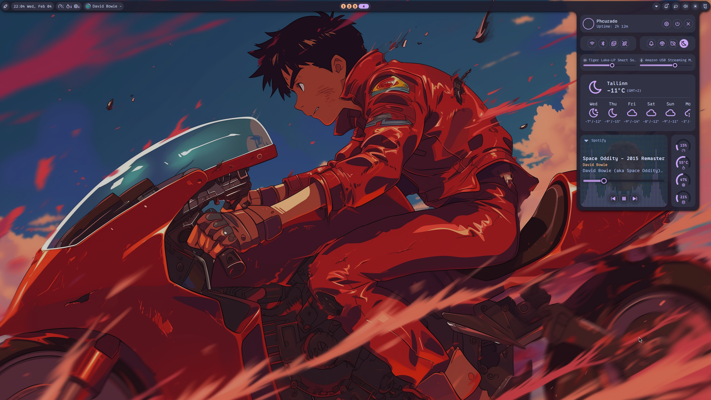
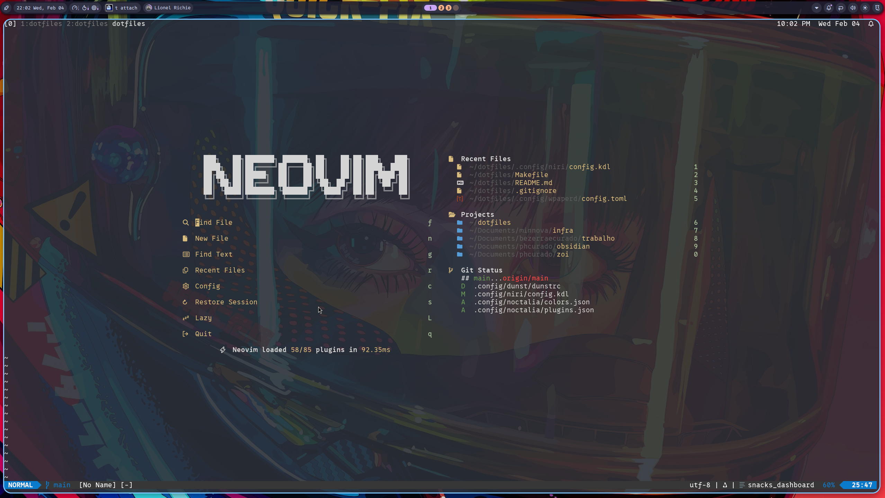

# ~/dotfiles

Dotfiles for Arch Linux and macOS, managed with [`dots`](https://github.com/phcurado/dots).

## Screenshots





## Fresh machine

Clone the repo and run the bootstrap script:

```sh
git clone git@github.com:phcurado/dotfiles.git ~/dotfiles
cd ~/dotfiles
./setup.sh
```

`setup.sh` installs `dots` into `~/.local/bin` if needed, then runs:

```sh
dots apply
```

`dots apply` checks the current machine, prints the changes, and asks for
confirmation before installing packages, linking files, copying fonts, starting
services, or changing user settings.

On Arch, reboot after the first apply so the shell, groups, display manager, and
system services all start from a clean login.

## Daily use

Preview changes:

```sh
dots check
```

Apply changes:

```sh
dots apply
```

List managed resources:

```sh
dots state list
```

The local state lives in `.dots/state.json` and is not committed.

## Layout

```txt
dots.lua              entrypoint
dots/common.lua       shared files, fonts, shell, and tools
dots/arch.lua         Arch packages, services, and Linux-only links
dots/macos.lua        Homebrew packages, services, and macOS-only links
dots/packages.lua     shared package list
fonts/                managed fonts
```

`dots.lua` uses normal Lua modules:

```lua
require("dots.common")

if dots.platform.family == "arch" then
  require("dots.arch")
end

if dots.platform.family == "darwin" then
  require("dots.macos")
end

require("dots.tools")
```

## What is managed

Common resources include:

- shell: `zsh`
- config links: Neovim, Ghostty, tmux, zsh, Starship, git, yazi, bat, btop, mise, zoxide
- fonts from `fonts/`
- mise tools
- local commands such as `pi`, `tree-sitter`, `weather`, and `tpane`

Arch resources include:

- pacman bootstrap packages: `base-devel`, `git`
- `paru` installed through pacman
- desktop packages for niri/noctalia
- user groups: `docker`, `wheel`
- system services: Bluetooth, Docker, NetworkManager, Tailscale

macOS resources include:

- Homebrew and Homebrew taps
- AeroSpace, SketchyBar, Borders, Ghostty, Brave, Discord, Obsidian, Docker Desktop, Tailscale, 1Password
- SketchyBar Lua bindings
- Homebrew services for SketchyBar and Borders

## Makefile

The Makefile is only a shortcut layer:

| Command               | Description              |
| --------------------- | ------------------------ |
| `make secrets.backup` | Print AGE key for backup |

## Notes

### macOS window management

Before using AeroSpace for the first time, turn off **Displays have separate
Spaces** in `System Settings > Desktop & Dock > Mission Control`, then log out
and back in. Grant Accessibility permissions to AeroSpace and SketchyBar when
prompted.

### Niri keybindings

| Key                | Action              |
| ------------------ | ------------------- |
| `Super + T`        | Terminal            |
| `Super + B`        | Browser             |
| `Super + Space`    | App launcher        |
| `Super + Q`        | Close window        |
| `Super + Tab`      | Previous workspace  |
| `Super + M`        | Power menu          |
| `Super + Alt + L`  | Lock screen         |
| `Super + Ctrl + W` | Random wallpaper    |
| `Print`            | Screenshot          |
| `Super + Y`        | Voice typing        |

### Secrets

The SOPS AGE key is restored from 1Password by `dots apply`.

To print the current key for backup:

```sh
make secrets.backup
```

### Macropad

Macropad configuration is in `macropad/macropad.ron`. Upload it with:

```sh
ansible-playbook --ask-become-pass ansible-scripts/macropad.yml
```
