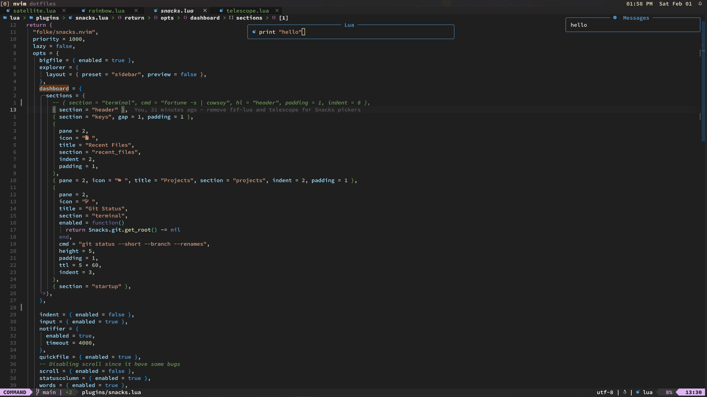
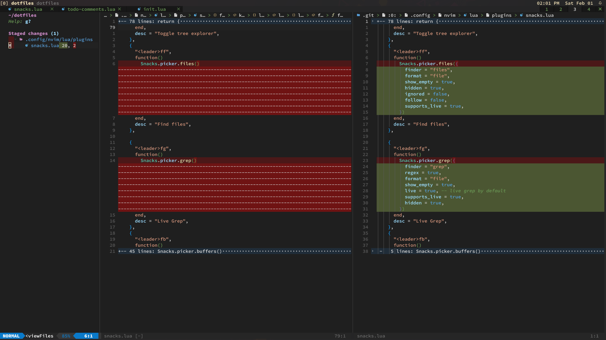

# ~/dotfiles

Dotfile configuration for `archlinux`.

## Screenshots







## Install

To setup the configuration files, it is recommended to install:

- [Neovim](https://neovim.io)
- [Ghostty](https://ghostty.org/)
- [Zsh](https://wiki.archlinux.org/title/Zsh)
- [Starship](https://starship.rs)
- [Stow](https://www.gnu.org/software/stow/manual/stow.html)
- [Paru](https://github.com/Morganamilo/paru)

When setting up, first clone this repository in the main `$HOME` folder.

```bash
cd ~/
git clone --recurse-submodules -j8 git@github.com:phcurado/dotfiles.git
cd dotfiles
```

## Main packages

Main packages for the dotfiles to work correctly:

### Paru

[Paru](https://github.com/Morganamilo/paru) is an AUR helper, which simplifies the process of installing packages from the Arch User Repository (AUR). To install Paru, you can follow these steps:

```bash
sudo pacman -S --needed base-devel
git clone https://aur.archlinux.org/paru.git
cd paru
makepkg -si

```

### Neovim

Neovim is my preferred text editor, which can be installed using:

```bash
paru neovim
```

### Ghostty

> [!IMPORTANT]
> Ghostty is configured to use the font [0xProto Nerd Font](https://github.com/0xType/0xProto), make sure you install it or change the font configuration [.config/ghostty/config](.config/ghostty/config) to a font that you have installed on your system. After installing `ghostty`, you can list the fonts with the command `ghostty +list-fonts`.

[Ghostty](https://ghostty.org/) is a terminal emulator that provides a modern and feature-rich command-line experience. To install Ghostty, you can use the following command:

```bash
paru ghostty
```

### Tmux

tmux is a terminal multiplexer that allows you to run multiple terminal sessions within a single window. To install tmux, you can use the following command:

```bash
paru tmux
```

To install tmux plugins, open a tmux session and press `prefix + I` (where `prefix` is usually `Ctrl + b` but I customized to `Ctrl + a`). This will automatically install the plugins defined in the `.tmux.conf` file.

### Mise

[Mise](https://github.com/jdx/mise) is similar to [asdf](https://asdf-vm.com/), useful for managing versions of programming languages and tools. To install Mise, you can use the following command:

```bash
paru mise
```

This dotfiles repository includes a `mise.toml` file that defines the versions of programming languages and tools that I use. To install the specified versions, run:

```bash
mise install
```

### Zsh

Follow the [Zsh wiki](https://wiki.archlinux.org/title/Zsh) to install Zsh and set it as the default shell.
In short, you can run:

```bash
paru zsh
chsh -s /usr/bin/zsh
```

Then reboot your system or log out and log back in to apply the changes.

### Starship

[Starship](https://starship.rs) is a cross-shell prompt that can be installed using:

```bash
paru starship
```

### GNU Stow

[GNU Stow](https://www.gnu.org/software/stow/manual/stow.html) is a symlink farm manager that allows you to manage your dotfiles. To install Stow, you can use the following command:

```bash
paru stow
```

Then use the GNU `stow` to create symlinks:

```bash
stow .
```

Some files might conflict, `stow` will throw an error and list the files that already exists on the OS.
It's possible to override the existent files, adding the `--adopt` argument on stow:

```bash
stow --adopt .
```

Since we are applying these files on a fresh install, most likely there won't be any conflicts but if you are applying these files on an existing system, you might want to check the files that will be overridden.

## Additional packages

Additional packages can be installed using `paru` with the `pkgs.txt` file located in the `arch-pkgs` folder:

```bash
paru -S - < arch-pkgs/pkgs.txt
```

or using the `Makefile`

```bash
make install
```

But it's recommended to check the `arch-pkgs/pkgs.txt` file and remove any packages that you don't want to install.

To save the current system dependencies in the `pkgs.txt` file run:

```bash
paru -Qqen > arch-pkgs/pkgs.txt
```

or using the `Makefile`

```bash
make tofile
```

This might add a lot of packages, that may be specific to your system, so it's recommended to check the `arch-pkgs/pkgs.txt` file and remove any packages that you don't want to install.

## Additional configuration

After a fresh install, something that I noticed is that the bluetooth service is not enabled by default. To enable it, you can run:

```bash
sudo systemctl start bluetooth.service
sudo systemctl enable bluetooth.service
```

I also use a macropad with some useful macros to switch between windows, open applications, etc. You can find the configuration inside the `macropad/macropad.ron` file. I configured mine using the [macropad_tool](https://github.com/kamaaina/macropad_tool). You can customize the configuration inside the ron file and then upload it to the macropad using the ansible script:

```bash
ansible-playbook --ask-become-pass ansible-scripts/macropad.yml
```
